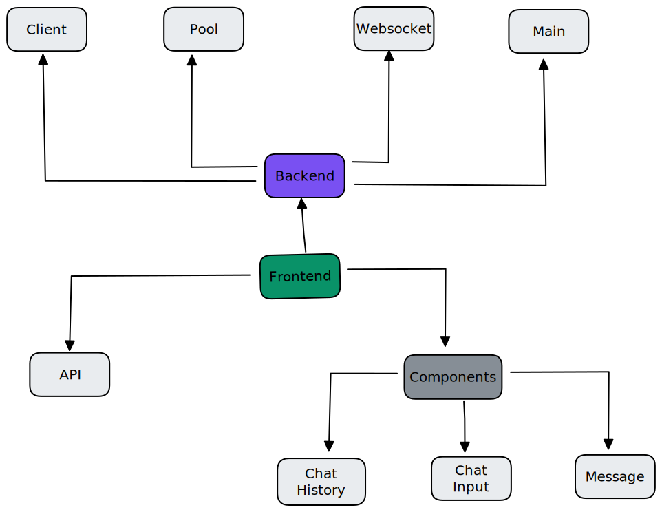
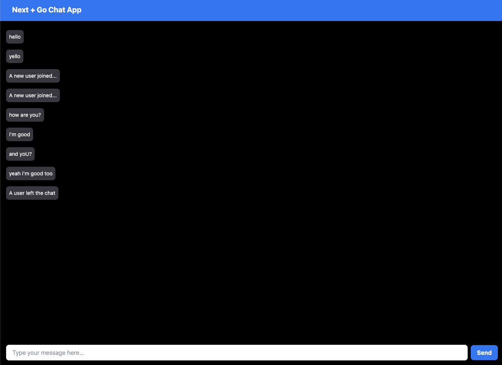

# Real Time Chat Application With Next + Go

## Description

This is a real time chat application built with Next.js and Go. It uses [Socket.IO](https://socket.io/) for real time communication and [Tailwind CSS](https://tailwindcss.com/) for styling.

## Architecture

[](./images/chat-go-arch.svg)

[](./images/app.png)

## Installation

Run the following commands to install the dependencies and start the application:

```bash
go mod download
go run main.go
```

## Usage

Open [http://localhost:3000](http://localhost:3000) with your browser to see the result.

## License

[MIT](https://choosealicense.com/licenses/mit/)
```